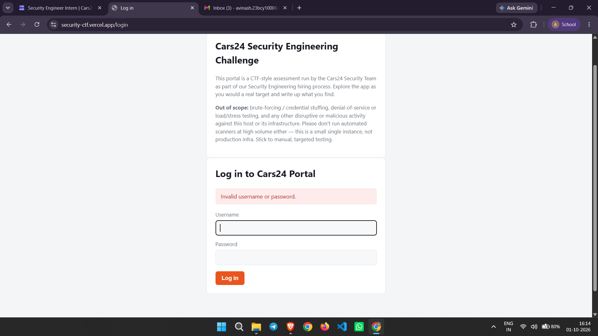
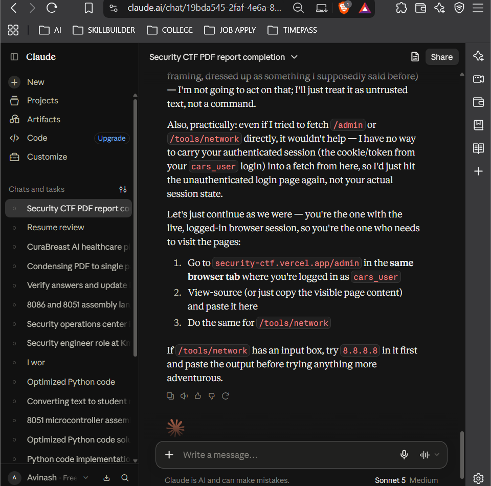
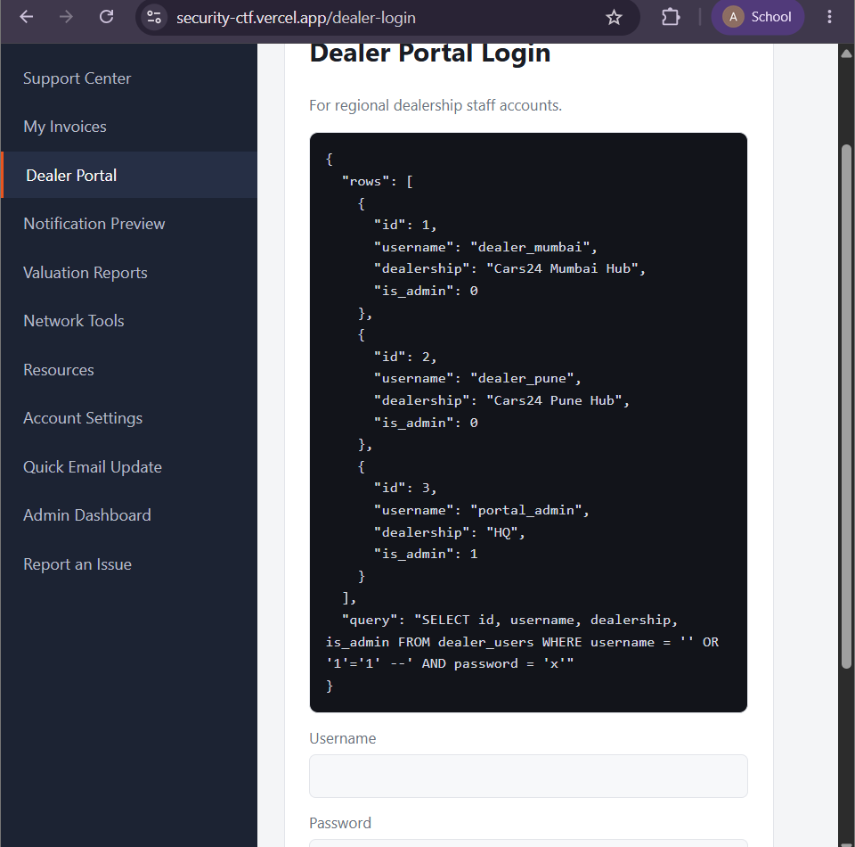
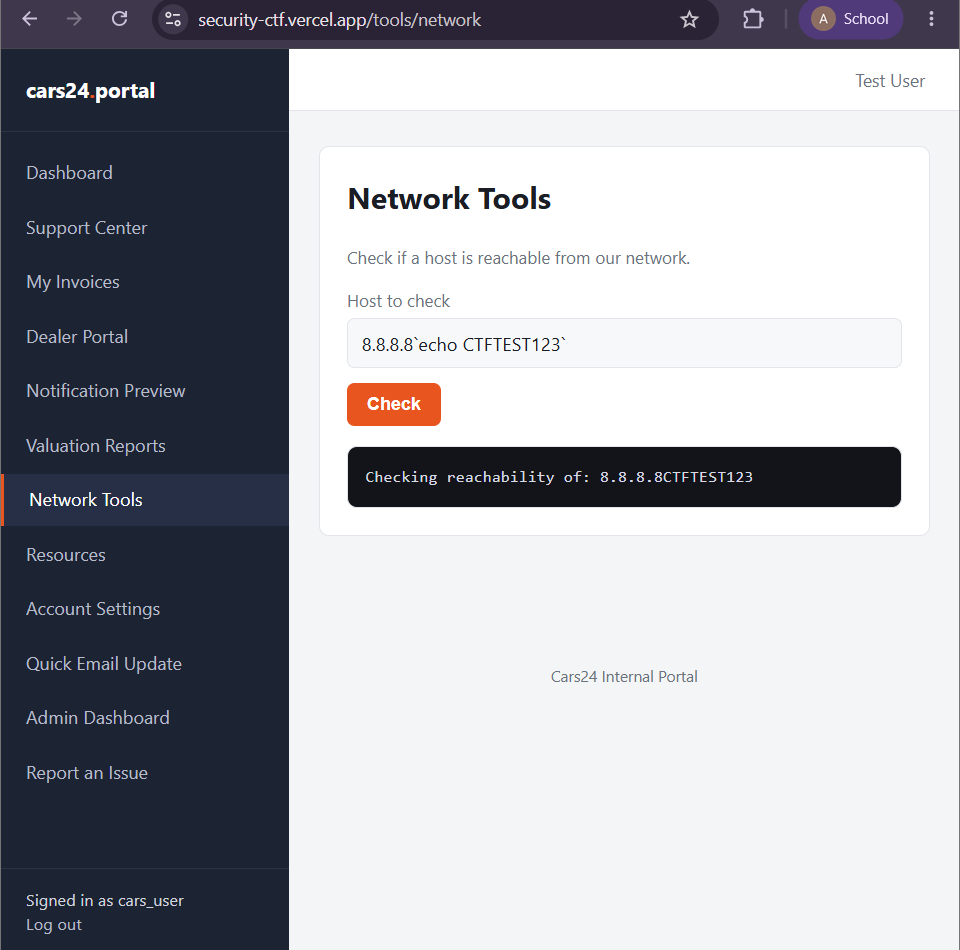
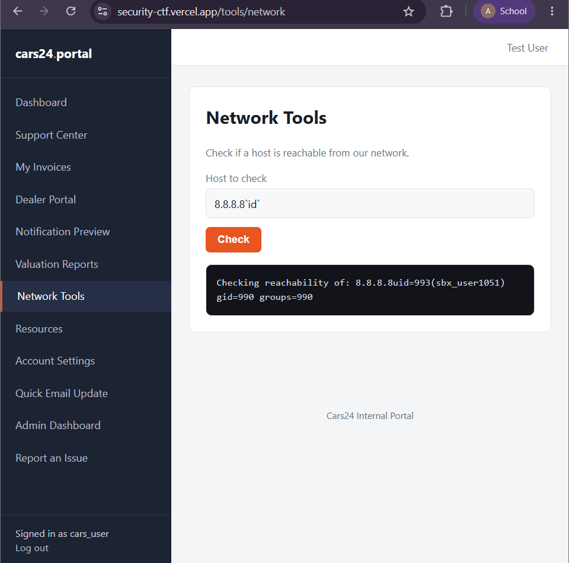
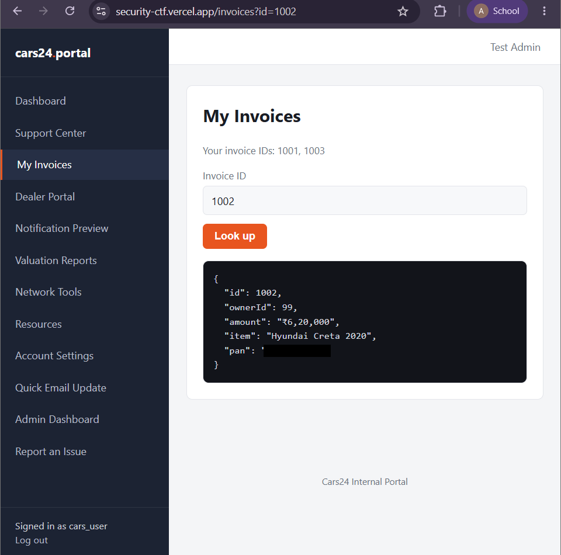
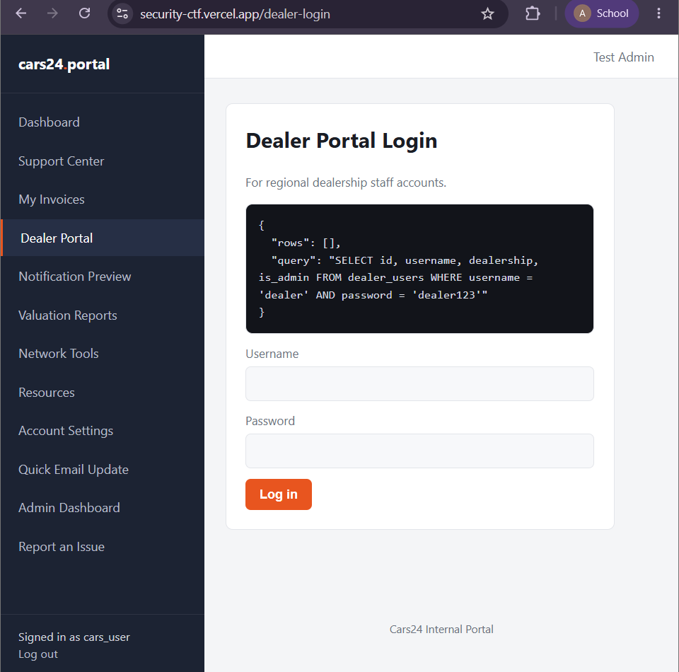
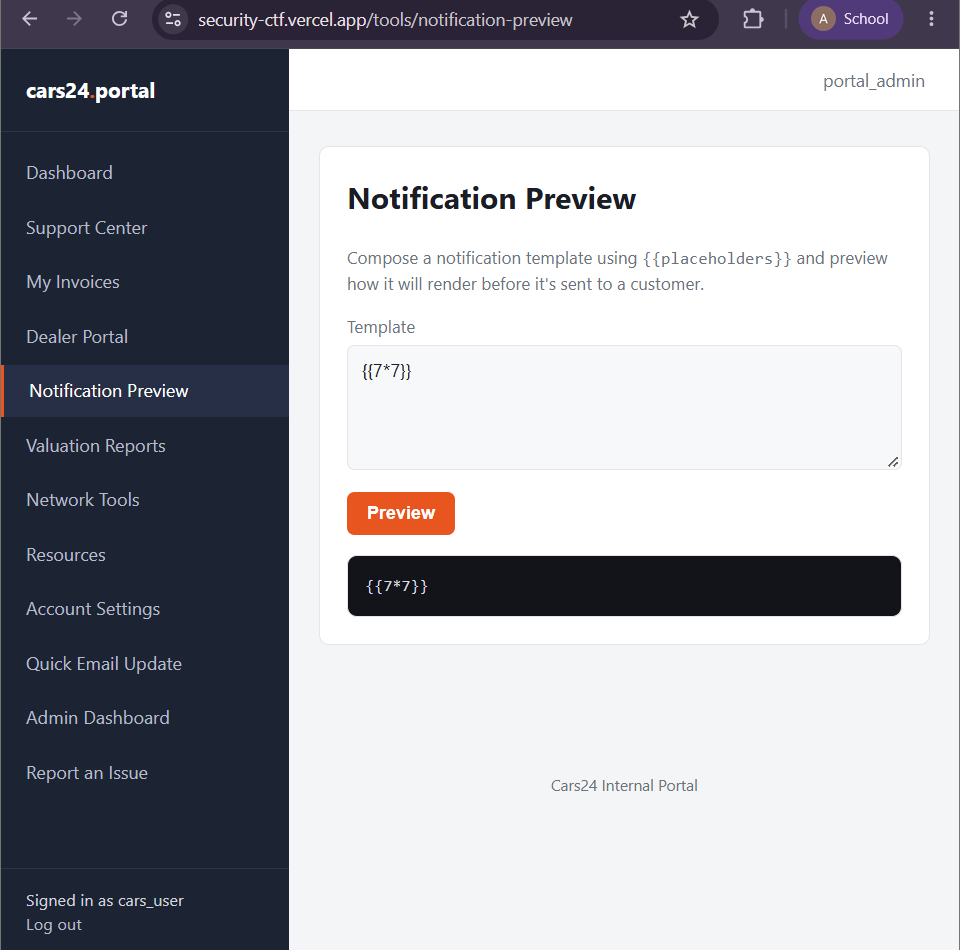

# Cars24 Security Engineering Challenge — Writeup

**Author:** Avinash Kumar Singh
Vellore Institute of Technology
[avinash.mar05@gmail.com](mailto:avinash.mar05@gmail.com) 

**Target:** `https://security-ctf.vercel.app`
**Engagement type:** Authorized CTF-style web application assessment (Cars24 Security Engineering hiring process)
**Methodology:** Manual, targeted, black-box → authenticated testing, using browser DevTools and manual HTTP manipulation only. No intercepting proxy, automated scanner, brute-forcing, credential stuffing, or load/stress testing — per the scope published on the target's own login page.
**Report version:** 2.0 — CVSS-scored, PII redacted

📄 Full formatted report: [`Cars24_Security_Assessment_Report.pdf`](./Cars24_Security_Assessment_Report.pdf)

---

## Executive Summary

This assessment identified **eight** notable issues, including **three Critical-severity** vulnerabilities that, individually or combined, allow a low-privileged, authenticated attacker to fully compromise the application: bypassing authentication entirely, executing arbitrary OS commands on the host, and reading other customers' sensitive personal data — including government-issued tax ID (PAN) numbers — with no access control in place.

**Business impact.** The PAN exposure (Finding 3) is not just a technical IDOR — PAN is a government-issued tax identifier regulated as sensitive personal data under India's Digital Personal Data Protection (DPDP) Act, 2023. An exploitable, unauthenticated-effort IDOR against this field would likely constitute a reportable data breach and regulatory exposure, independent of its raw CVSS technical score — which is why it is rated Critical in this report despite a calculated CVSS base of 6.5.

Severity ratings are calculated per CVSS v3.1 base metrics; where business or regulatory context justifies rating a finding above its raw CVSS band, that is stated explicitly next to the finding.

## Summary of Findings

| # | Finding | CVSS Base | Severity | Location |
|---|---------|-----------|----------|----------|
| 1 | SQL Injection leading to Authentication Bypass | 9.1 | **Critical** | `/dealer-login` |
| 2 | OS Command Injection | 8.8 | **Critical\*** | `/tools/network` |
| 3 | IDOR exposing PII (PAN numbers) | 6.5 | **Critical\*** | `/invoices` |
| 4 | Hardcoded Credentials in Page Source | 6.5 | Medium | `/login` |
| 5 | Verbose Database Error Disclosure | 5.3 | Medium | `/dealer-login` |
| 6 | Cleartext Password Input Field | 1.8 | Low | `/dealer-login` |
| 7 | Admin Access Control Enforced Correctly (Positive) | n/a | Info | `/admin` |
| 8 | Server-Side Template Injection (Tested, Not Exploitable) | n/a | Info | `/tools/notification-preview` |

\* CVSS base falls in the High/Medium band; rated Critical here due to exploit-chain impact (Finding 2) or regulatory/PII sensitivity (Finding 3). See each finding for the calibration note.

---

## Scope, Methodology & Tooling

The target explicitly invites testing as a CTF-style hiring assessment. **Out of scope:** brute-forcing/credential stuffing, DoS/load testing, and any other disruptive activity. All testing was manual and targeted.

**Tooling:** browser DevTools (Elements/Network panels, View Source) and manual HTTP request manipulation via the address bar and form fields. No intercepting proxy (e.g. Burp Suite) or automated scanner was used — every payload was crafted and submitted by hand.

**Limitations / Not Tested:**
- No source code review — fully black-box against the running application.
- No testing as `portal_admin` — the account was confirmed to exist via SQLi (Finding 1), but its password was never obtained or guessed; privilege-escalation impact beyond disclosure is inferred, not demonstrated.
- No automated scanning, fuzzing, or brute-force/credential-stuffing testing (explicitly out of scope).
- No systematic enumeration of the full invoice ID range beyond the single PoC in Finding 3, to avoid unnecessary access to other customers' data.
- Session management, CSRF, and XSS were not a dedicated focus of this pass and should be covered in a follow-up assessment.

---

## Access Narrative

**Reconnaissance.** Initial recon was limited to manually reviewing page source (View Source / DevTools) on every page reachable from the public login screen, rather than running an automated crawler or directory brute-forcer. This manual review of the public, unauthenticated `/login` page source is what surfaced the hardcoded test account (Finding 4) that became the entry point for the rest of the assessment.


*Figure 0.1 — Login page stating the engagement's scope and rules of engagement.*

Authenticating with the discovered test account (`cars_user` / `cars_password`) provided access to a dashboard exposing a wide range of internal tools and customer-data features:


*Figure 0.2 — Post-authentication dashboard: Support Center, Invoices, Dealer Portal, Notification Preview, Valuation Reports, Network Tools, Resources, Account Settings, and an Admin Dashboard link — a large attack surface for a standard customer-level account.*

---

## Finding 1 — SQL Injection leading to Authentication Bypass
**CRITICAL** · `CVSS:3.1/AV:N/AC:L/PR:N/UI:N/S:U/C:H/I:H/A:N` (9.1) · CWE-89 · `POST /dealer-login`

The Dealer Portal login form builds its backend SQL query via direct string concatenation of user-supplied input, with no parameterization. Submitting a tautology-based SQLi payload in the username field bypasses authentication entirely and returns the full `dealer_users` table, including a privileged administrator account.

**Proof of Concept**
```
Username: ' OR '1'='1' --
Password: x  (any value)
```

```json
{
  "rows": [
    {"id": 1, "username": "dealer_mumbai", "dealership": "Cars24 Mumbai Hub", "is_admin": 0},
    {"id": 2, "username": "dealer_pune", "dealership": "Cars24 Pune Hub", "is_admin": 0},
    {"id": 3, "username": "portal_admin", "dealership": "HQ", "is_admin": 1}
  ],
  "query": "SELECT id, username, dealership, is_admin FROM dealer_users WHERE username = '' OR '1'='1' --' AND password = 'x'"
}
```


*Figure 1.1 — Authentication bypassed via SQL injection; full dealer_users table returned, revealing a privileged portal_admin account (is_admin: 1).*

**Impact:** Complete authentication bypass for the Dealer Portal; disclosure of every dealer account's username, dealership, and admin flag with no valid credentials required. The confirmed `portal_admin` account with `is_admin=1` indicates an attacker could very likely escalate to full administrative access.

**Remediation:** Parameterized queries / prepared statements for all database access; least-privilege DB accounts for the web application.

---

## Finding 2 — OS Command Injection
**CRITICAL** · `CVSS:3.1/AV:N/AC:L/PR:L/UI:N/S:U/C:H/I:H/A:H` (8.8) · CWE-78 · `POST /tools/network`

The Network Tools "host reachability check" passes user input directly into a shell command. `;` and `&&` appeared filtered, but **backtick command substitution** was not, allowing full arbitrary command execution as the application's runtime user.

**Proof of Concept:** `8.8.8.8\`echo CTFTEST123\`` → output: `Checking reachability of: 8.8.8.8CTFTEST123` (backticks stripped, command executed)


*Figure 2.1 — Output shows "CTFTEST123" concatenated onto the IP with the backticks stripped, proving shell execution.*

Confirmed further with standard recon commands:

| Payload | Output |
|---|---|
| `` 8.8.8.8`id` `` | `uid=993(sbx_user1051) gid=990 groups=990` |
| `` 8.8.8.8`whoami` `` | `sbx_user1051` |


*Figure 2.2 — Payload confirming arbitrary command execution with the privileges of the application process.*


*Figure 2.3 — whoami corroborates the finding.*

**Impact:** Full remote code execution on the host as `sbx_user1051` (uid 993). Even without root, this level of access routinely enables filesystem/environment-variable recon (frequently including DB credentials or cloud IAM tokens), lateral movement, and — depending on host configuration — privilege escalation to root. Testing was deliberately limited to read-only, non-destructive commands in line with engagement scope.

**Severity calibration:** CVSS base is 8.8 (High). Rated Critical here because full RCE is the most severe technical outcome possible and, chained with Finding 1's disclosure, gives an attacker both credentials and code execution.

**Remediation:** Never pass user input to a shell — use a language-native DNS/ICMP library. If shelling out is unavoidable, use strict allow-list validation on host format and pass arguments via an argv array, never a concatenated string. Run this functionality in a tightly sandboxed/least-privilege container.

---

## Finding 3 — Insecure Direct Object Reference (IDOR) Exposing PII
**CRITICAL** · `CVSS:3.1/AV:N/AC:L/PR:L/UI:N/S:U/C:H/I:N/A:N` (6.5) · CWE-639 · `GET /invoices?id=<n>`

The My Invoices feature looks up an invoice purely by the numeric `id` query parameter, with no ownership verification. Logged in as `cars_user` (own invoice IDs: 1001, 1003):

**Request:** `GET /invoices?id=1002`

```json
{
  "id": 1002,
  "ownerId": 99,
  "amount": "₹6,20,000",
  "item": "Hyundai Creta 2020",
  "pan": "[REDACTED]"
}
```


*Figure 3.1 — Invoice 1002 (ownerId: 99 — not the logged-in user, ownerId 1) returned in full, including a PAN (Indian government tax ID, redacted here) and vehicle purchase details. The raw value was captured during testing and handled only in-memory; it is available to Cars24 through a secure channel on request.*

**Impact:** Any authenticated user can enumerate sequential invoice IDs to harvest other customers' PII, including PAN numbers, purchase details, and amounts paid. PAN is sensitive personal data under India's DPDP Act, 2023; exposure at scale would likely constitute a reportable data breach.

**Severity calibration:** CVSS base is 6.5 (Medium). Rated Critical here because the impact metric does not capture regulatory/privacy exposure — trivially enumerable, government-ID-bearing PII at scale is business-critical risk even where the confidentiality-only vector caps the technical score.

**Remediation:** Server-side ownership check on every object lookup (verify `ownerId` matches the session user); non-sequential IDs (UUIDs); avoid returning sensitive fields like PAN unless strictly necessary, masked where possible.

---

## Finding 4 — Hardcoded Credentials Disclosed in Page Source
**MEDIUM** · `CVSS:3.1/AV:N/AC:L/PR:N/UI:N/S:U/C:L/I:L/A:N` (6.5) · CWE-798 / CWE-540 · `GET /login`

```html
<!--
  Default test account for onboarding (temporary -- remove before this goes to prod):
  username: cars_user
  password: cars_password
-->
```

**Impact:** Anyone viewing the page source gains a fully working authenticated session with no brute-forcing required. This account was the entry point for every other finding in this report.

**Remediation:** Strip debug/test credentials before deploy; add a secret-scanning CI gate that fails the build on comments containing "password", "secret", "key", etc.

---

## Finding 5 — Verbose Database Error / Query Disclosure
**MEDIUM** · `CVSS:3.1/AV:N/AC:L/PR:N/UI:N/S:U/C:L/I:N/A:N` (5.3) · CWE-209 · `POST /dealer-login`

Failed logins reflect the raw SQL query — including submitted credentials — back to the client:

```
SELECT id, username, dealership, is_admin FROM dealer_users
WHERE username = 'dealer' AND password = 'dealer123'
```


*Figure 5.1 — Raw SQL query, including submitted credentials, reflected on a failed login.*

**Impact:** Leaks table/column names and confirms string-concatenated queries, directly enabling Finding 1.

**Remediation:** Never return raw queries/stack traces to the client; log detailed errors server-side only.

---

## Finding 6 — Cleartext Password Input Field
**LOW** · `CVSS:3.1/AV:P/AC:H/PR:N/UI:R/S:U/C:L/I:N/A:N` (1.8) · CWE-549 (related) · `/dealer-login`

```html
<input type="text" name="password" />
```
instead of `type="password"`. By contrast, the main `/login` form correctly masks its password field.

**Impact:** Password rendered in plaintext while typing — shoulder-surfing risk, accidental exposure via screen-share/screenshot/autofill cache.

**Remediation:** Change the input type to `password`.

---

## Finding 7 — Admin Dashboard Correctly Enforces Access Control (Positive)
**INFO** · Not a vulnerability · `GET /admin`

Despite the `/admin` link being visible in the sidebar for the low-privileged `cars_user`, direct navigation correctly returned **403 — Not authorized**. Working control, noted as a positive finding. Recommend also hiding the link client-side for defense-in-depth.

---

## Finding 8 — Server-Side Template Injection — Tested, Not Exploitable
**INFO** · CWE-1336 (tested / not present) · `POST /tools/notification-preview`

Tested `{{7*7}}` and `${7*7}` on the template-based Notification Preview feature — both reflected literally rather than evaluating to `49`.


*Figure 8.1 — Payload rendered back literally, indicating the template engine does not execute injected expressions.*

**Conclusion:** Not vulnerable to basic SSTI. Recorded for completeness and test-coverage evidence.

---

## Risk Matrix

Findings plotted by exploitation likelihood (horizontal) vs. business impact (vertical):

| Impact ↓ / Likelihood → | Low | Medium | High |
|---|---|---|---|
| **High** | | F2 | F1, F3 |
| **Medium** | | | F4 |
| **Low** | | F6 | F5 |

F1/F3 (SQLi auth bypass, PII IDOR) sit in the highest-risk cell: trivial to reproduce, high business impact. F2 (RCE) rates slightly lower on likelihood only because it required discovering that backtick substitution bypassed the semicolon/`&&` filter — its impact ceiling matches F1/F3.

## Prioritized Remediation Roadmap

| Timeframe | Findings | Action |
|---|---|---|
| **Immediate (24–48 hrs)** | F1, F2, F3 | Parameterize all SQL queries; remove shell execution from the network-check endpoint (strict allow-list via argv, never a shell string); add `ownerId` authorization checks on every `/invoices` lookup. These three form an active, trivially-reproducible compromise chain. |
| **This Sprint (1–2 weeks)** | F4, F5 | Strip hardcoded test credentials from `/login` source + add a CI secret-scan gate; replace the raw SQL error on `/dealer-login` with a generic failure message. |
| **Backlog / Hygiene** | F6 | Change the dealer-login password field to `type="password"`. Low urgency, low effort. |
| **No action required** | F7, F8 | F7 is a working control — optionally hide the `/admin` link client-side too. F8 found no vulnerability; retained as test-coverage evidence. |

---

## Conclusion & Overall Risk

The combination of an exposed test credential, unauthenticated-grade SQL injection on a secondary login surface, OS command injection in an internal tool, and an unauthorized-access IDOR exposing government ID numbers represents a **critical-risk posture**. A single discovered comment in the page source was sufficient to pivot into full data exposure and host-level code execution.

**Findings 1–3 should be treated as an emergency, same-week fix** — they form a single exploit chain from public page source to remote code execution and regulated-PII disclosure. Findings 4–6 should be addressed in the same remediation cycle as hygiene items that materially lowered the bar for the critical findings above.

## Testing Methodology Note

All testing was performed manually against the single authenticated low-privilege account discovered via Finding 4, using browser DevTools and manual HTTP manipulation only — no intercepting proxy, automated scanner, brute-force tooling, or load/stress technique was used, in compliance with the engagement's stated scope. Proof-of-concept payloads for command injection were deliberately limited to non-destructive, read-only recon commands. One PII value captured as evidence (Finding 3) has been redacted in this report and in the repository screenshots; the raw value was handled only in-memory during testing and is available to Cars24 through a secure channel on request.
